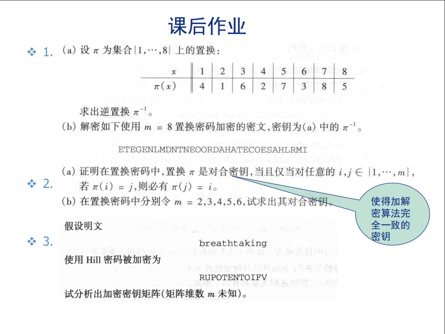

# chap02

[在静态文档中查看本文件](https://icefox-saber.github.io/cryptography/chap02)



## 2.1

### (2.1.a)

| x             | 1    | 2    | 3    | 4    | 5    | 6    | 7    | 8    |
| :------------ | :--- | :--- | :--- | :--- | :--- | :--- | :--- | :--- |
| $\pi^{-1}(x)$ | 2    | 4    | 6    | 1    | 8    | 3    | 5    | 7    |

### (2.1.b)

$$\text{ETEGENLMDNTNEOORDAHATECOESAHLRMI}$$

$$\downarrow$$

$$\text{ETEGENLM} \quad \text{DNTNEOOR} \quad \text{DAHATECO} \quad \text{ESAHLRMI}$$

$$\downarrow$$

$$\text{GENTLEME} \quad \text{NDONOTRE} \quad \text{ADEACHOT} \quad \text{HERSMAIL}$$

$$\downarrow$$

$$\text{GENTLEMENDONOTREADEACHOTHERSMAIL}$$

## 2.2

### (2.2.a)

- 充分性：

$$
\begin{aligned}
    \because \pi \text{ 是对合密钥}\cr
    \forall i,j \in \lbrace 1,2,3...,m \rbrace\cr
    \text{若加密： } \pi(i) = j\cr
    \implies \text{解密： } \pi^{-1}(j) = i\cr
    \text{又} \because \pi() = \pi^{-1}()\cr
    \therefore  \pi(j) = i\cr
\end{aligned}
$$

- 必要性:

$$
\begin{aligned}
    \forall i,j \in \lbrace 1,2,3...,m \rbrace, \pi(i) = j \implies \pi(j) = i\cr
    \implies \pi^{-1}(i) = j \And \pi^{-1}(j) = i\cr
    \implies \pi() = \pi^{-1}()\cr
    \implies \pi \text{ 是对合密钥}\cr
\end{aligned}
$$

### (2.2.b)

用如下cpp程序可得结果

```cpp
#include <iostream>
#include <vector>

using namespace std;

static int m = 0;
static int pinum = 1;

//check v[v[i]] ==i，if true, output v
void checkdualpermutation(vector<int> & v) {
    for (size_t i = 1; i < v.size(); i++)
    {
        if (v[v[i]] != i)
        {
            return;
        }
    }
    if (v.size() - 1 != m)
    {
        m = v.size() - 1;
        pinum = 1;
    }
    cout<<"pi"<<pinum++<<':';

    for (size_t i = 1; i <= m; i++)
    {
        cout << v[i] << " ";
    }
    cout << endl;
}

void creatpremutation(vector<int> & v, int l) {
    //排列生成完成，检查是否满足条件
    if (l == v.size())
    {
        checkdualpermutation(v);
    }
    
    for (size_t i = l; i < v.size(); i++)
    {
        swap(v[l], v[i]);
        creatpremutation(v, l+1);
        swap(v[l], v[i]);
    }
}

int main() {

    //m from 2 to 6
    for (size_t i = 2; i < 7; i++)
    {
        //构建vector
        vector<int> v;

        for (int j = 0; j <= i; j++)
        {
            v.push_back(j);
        }

        cout<<"x: ";

        //输出vector
        for (size_t j = 1; j < v.size(); j++)
        {
            cout << v[j] << " ";
        }
        cout<<endl;
        creatpremutation(v,1);
        
    }
    
}
```

结果如下：

```txt
x: 1 2 
pi1:1 2 
pi2:2 1 

x: 1 2 3 
pi1:1 2 3 
pi2:1 3 2 
pi3:2 1 3 
pi4:3 2 1 

x: 1 2 3 4 
pi1:1 2 3 4 
...
pi10:4 3 2 1 

x: 1 2 3 4 5 
pi1:1 2 3 4 5 
...
pi26:5 4 3 2 1 

x: 1 2 3 4 5 6 
pi1:1 2 3 4 5 6 
...
pi76:6 5 4 3 2 1 
```

验证:

设$N(m)$ 为对应存在密钥数

$$
\begin{aligned}
    N(6)
    & = \frac{{6 \choose 2}{4 \choose 2}{2 \choose 2}}{P(3,3)} + \frac{{6 \choose 2}{4 \choose 2}{2 \choose 2}}{P(2,2)} + \frac{{6 \choose 4}{2 \choose 2}}{P(1,1)} + \frac{{6 \choose 6}}{P(0,0)}\cr
    & = \frac{15 * 6 }{6} + \frac{15 * 6}{2} + \frac{15}{1} + \frac{1}{1}\cr
    & = 76\cr
    N(5)
    & = \frac{{5 \choose 1}{4 \choose 2}{2 \choose 2}}{P(2,2)} + \frac{{5 \choose 3}{2 \choose 2}}{P(1,1)} + \frac{{5 \choose 5}}{P(0,0)}\cr
    & = \frac{5 * 6}{2} + \frac{10}{1} + \frac{1}{1}\cr
    & = 26\cr
\end{aligned}
$$

理论密钥数与实际相同，由此可见程序生成的答案是正确的。

## 2.3

breathtaking = $<1 , 17 , 4 , 0 , 19 , 7 , 19 , 0 , 10 , 8 , 13 , 6>$

RUPOTENTOIFV = $<17 , 20 , 15 , 14 , 19 , 4 , 13 , 19 , 14 , 8 , 5 , 21>$

$$
\begin{aligned}
    \begin{pmatrix}
        k_{11} & k_{12} & k_{13}\cr
        k_{21} & k_{22} & k_{23}\cr
        k_{31} & k_{32} & k_{33}\cr
    \end{pmatrix}
    \begin{pmatrix}
        1 & 0 & 19\cr
        17 & 19 & 0\cr
        4 & 7 & 10\cr
    \end{pmatrix}
    =
    \begin{pmatrix}
        17 & 14 & 13\cr
        20 & 19 & 19\cr
        15 & 4 & 14\cr
    \end{pmatrix}(mod 26)\cr
    \implies
    \begin{pmatrix}
        1 & 0 & 19\cr
        17 & 19 & 0\cr
        4 & 7 & 10\cr
    \end{pmatrix}^{T}
    \begin{pmatrix}
        k_{11} & k_{12} & k_{13}\cr
        k_{21} & k_{22} & k_{23}\cr
        k_{31} & k_{32} & k_{33}\cr
    \end{pmatrix}^{T}
    =
    \begin{pmatrix}
        17 & 14 & 13\cr
        20 & 19 & 19\cr
        15 & 4 & 14\cr
    \end{pmatrix}^{T}(mod 26)\cr
    \implies
    \begin{pmatrix}
        1 & 17 & 4\cr
        0 & 19 & 7\cr
        19 & 0 & 10\cr
    \end{pmatrix}
  \begin{pmatrix}
      k_{11}\cr
      k_{12}\cr
      k_{13}\cr
  \end{pmatrix}
  =
  \begin{pmatrix}
      17\cr
      14\cr
      13\cr
  \end{pmatrix}(mod 26)\cr
  \begin{pmatrix}
      1 & 17 & 4\cr
      0 & 19 & 7\cr
      19 & 0 & 10\cr
  \end{pmatrix}
  \begin{pmatrix}
      k_{21}\cr
      k_{22}\cr
      k_{23}\cr
  \end{pmatrix}
  =
  \begin{pmatrix}
      20\cr
      19\cr
      19\cr
  \end{pmatrix}(mod 26)\cr
  \begin{pmatrix}
      1 & 17 & 4\cr
      0 & 19 & 7\cr
      19 & 0 & 10\cr
  \end{pmatrix}
  \begin{pmatrix}
      k_{31}\cr
      k_{32}\cr
      k_{33}\cr
  \end{pmatrix}
  =
  \begin{pmatrix}
      15\cr
      4\cr
      14\cr
  \end{pmatrix}(mod 26)\cr
  \implies
  \begin{pmatrix}
        k_{11} & k_{12} & k_{13}\cr
        k_{21} & k_{22} & k_{23}\cr
        k_{31} & k_{32} & k_{33}\cr
    \end{pmatrix}
    =
    \begin{pmatrix}
         3 & 4 & 6\cr
         21 & 15 & 14\cr
        20 & 23 & 5\cr
    \end{pmatrix}(mod 26)\cr
\end{aligned}
$$

最后一步由机器枚举得出,

验证：

$$
\begin{aligned}
    \begin{pmatrix}
         3 & 4 & 6\cr
         21 & 15 & 14\cr
        20 & 23 & 5\cr
    \end{pmatrix}
    \begin{pmatrix}
        8\cr
        13\cr
        6\cr
    \end{pmatrix}
    =
    \begin{pmatrix}
        8\cr
        5\cr
        21\cr
    \end{pmatrix}(mod 26)\cr
\end{aligned}
$$

破解成功，因为3不是2的倍数，所有不是2阶密钥，1阶密钥经验证不是。
