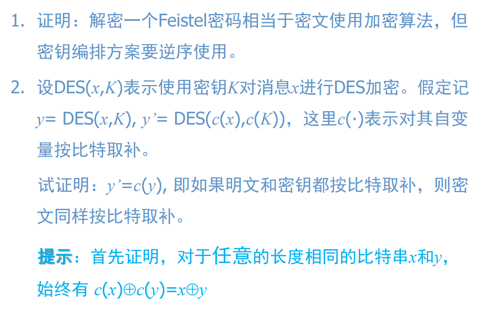

# chap03

[陈永俊] [522031910203]

## 3.1

$$
\begin{aligned}
    LE_{i} & = RE_{i-1}\cr
    RE_{i} & = LE_{i-1} \oplus F(RE_{i-1},K_{i})\cr
    & = LE_{i-1} \oplus F(LE_{i},K_{i})\cr
    \implies RE_{i} & = LE_{i+1}\cr
    LE_{i} & = RE_{i+1} \oplus F(LE_{i+1},K_{i+1})\cr
    & = RE_{i} \oplus F(RE_{i},K_{i+1})\cr
    \text{until } i & = 0 \text{ we get the plaintext}
\end{aligned}
$$

由上述推导知，只要把加密算法中对LE和RE的操作对调(或者在进入加密算法前把LE和RE对调，算法结束再换回来)，以及$K_{i}$反序使用，就可解密出明文。

## 3.2

$$
\begin{aligned}
    c(x)\oplus c(y) & = x \oplus 1 \oplus y \oplus 1\cr
    & = x \oplus y \oplus 1 \oplus 1\cr
    & = x \oplus y\cr
\end{aligned}
$$

对于置换$PO$(包括$IP,IP^{-1},E,PC1,PC2,LS,P$)：

$$
\begin{aligned}
    PO(c(x)) & = c(PO(x))\cr
\end{aligned}
$$

设密钥生成算法为KG

$$
\begin{aligned}
    \lbrace K_1,k_2,...,K_{16}\rbrace & = KG(K)\cr
    \lbrace c(K_{1}),c(K_{2}),...,c(K^{16})\rbrace & = KG(c(K))\cr
\end{aligned}
$$

DES的单轮为：

$$
\begin{aligned}
    L_{i} = R_{i-1}\cr
    R_{i} = L_{i-1} \oplus F(R_{i-1},K_{i})\cr
    F(R_{i-1},K_{i})  = P(S(E(R_{i-1})\oplus K_{i}))\cr
\end{aligned}
$$

最后证明：

$$
\begin{aligned}
    y' = c(y)\cr
    \iff L_{i} = c(L_{i}') \And R_{i} = c (R_{i}')\cr
    \iff R_{i-1} = c(R_{i-1}') \And L_{i-1} \oplus P(S(E(R_{i-1})\oplus K_{i}))  = c(L_{i-1}' \oplus P(S(E(R_{i-1}')\oplus K_{i}')))\cr
    \iff P(S(E(R_{i-1})\oplus K_{i})) = P(S(E(R_{i-1}')\oplus K_{i}')) \quad (\text{assume } L_{i-1} = c(L_{i-1}') \And R_{i-1} = c(R_{i-1}'))\cr
    \iff E(R_{i-1})\oplus K_{i} = E(R_{i-1}')\oplus K_{i}'\cr
    \iff E(R_{i-1})\oplus K_{i} = c(E(R_{i-1}))\oplus c(K_{i})\cr
\end{aligned}
$$

因为$i=0$时, $L_{i-1} = c(L_{i-1}') \And R_{i-1} = c(R_{i-1}')$所以$y' = c(y)$。
