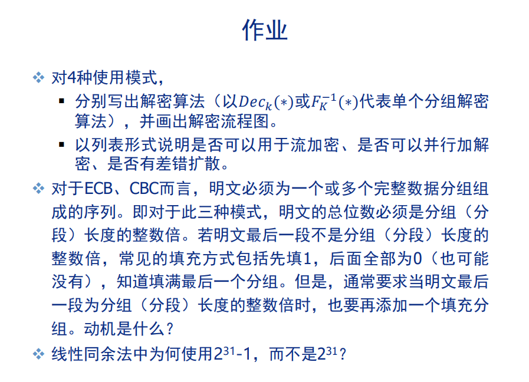
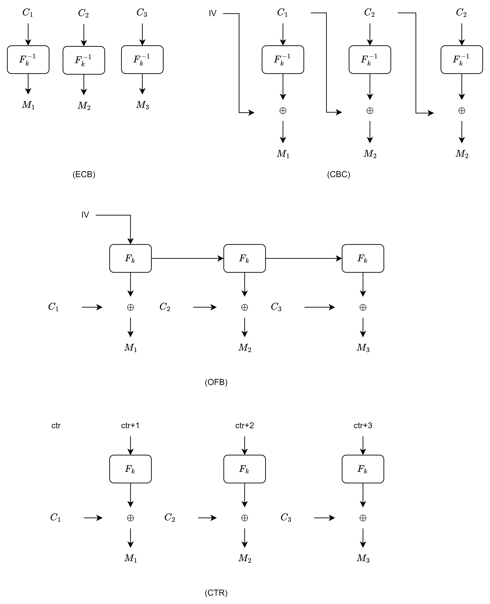

# chap05

[陈永俊] [522031910203]

## 5.1

图片见 Figure 5.1

- ECB:

$$
\begin{aligned}
    M_{i}=F_{k}^{-1}(C_{i})\cr
\end{aligned}
$$

- CBC:

$$
\begin{aligned}
    M_{1} = IV\oplus F_{k}^{-1}(C_{1})\cr
    M_{i+1} = C_{i}\oplus F_{k}^{-1}(C_{i+1})\cr
\end{aligned}
$$

- OFB:

$$
\begin{aligned}
    O_{0} = IV\cr
    O_{i+1} = F_{k}(O_{i})\cr
    M_{i} = C_{i} \oplus O_{i}\cr
\end{aligned}
$$

- CTR:

$$
\begin{aligned}
    M_{i} = C_{i} \oplus F_{k}(ctr+i)\cr
\end{aligned}
$$

| Encryption | ECB  | CBC                    | OFB      | CTR       |
| :--------- | :--- | :--------------------- | :------- | :-------- |
| 流加密     | 是   | 是                     | 是       | 是        |
| 并行加解密 | 是   | 并行解密，但不并行加密 | 是       | 是        |
| 差错扩散   | 否   | 是                     | IV有扩散 | ctr有扩散 |

## 5.2

- 错误校验：添加一个填充分组，可以检验填充分组是否出错。如无，则无法分别明文长度恰好和填充错误。
- 作为EOF

## 5.3

因为计算机表示的最大非负整数为$2^{31}-1$, 在32位计算机系统中，无法直接表示$2^{31}$,$2^{31}$是 $- 2^{31}$。
