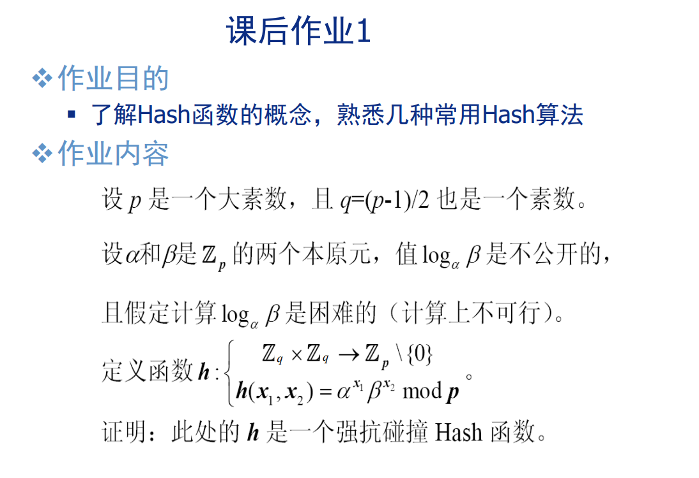
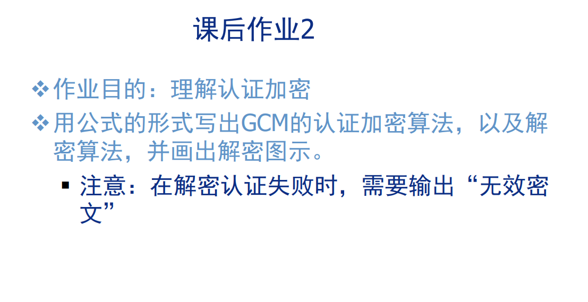
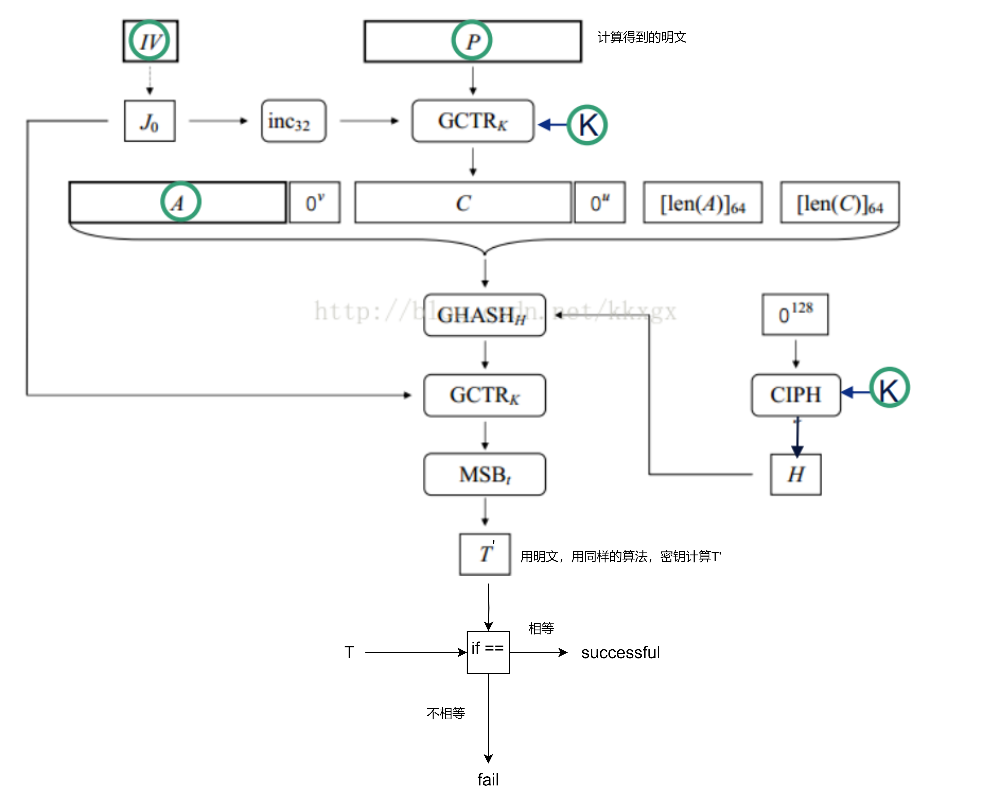

# chap07

[陈永俊] [522031910203]

## 7.1

$$
\begin{aligned}
    \forall (x_1,x_2):\cr
    h(y_1,y_2) = h(x_1,x_2)\cr
    \iff \alpha^{y_1}\beta^{y_2} = \alpha^{x_1}\beta^{x_2} \, mod \, p\cr
    \iff \alpha^{y_{1}-x_{1}} = \beta^{x_{2}-y_{2}}\cr
    \iff y_1-x_1 = (x_2-y_2)\log_{\alpha}\beta\cr
\end{aligned}
$$

最后一步需要计算$\log_{\alpha}\beta$的值，这是不可行的，所以该**h**是一个强抗碰撞的Hash函数。

## 7.2

加密算法：

$$
X_i =
\begin{cases}
    0, & \text{for } i = 0\cr
    (X_{i-1} \oplus A_i) \cdot H, & \text{for } i = 1, \dots, m - 1\cr
    (X_{m-1} \oplus (A_m^* \parallel 0^{128 - v})) \cdot H, & \text{for } i = m\cr
    (X_{i-1} \oplus C_i) \cdot H, & \text{for } i = m + 1, \dots, m + n - 1\cr
    (X_{m+n-1} \oplus (C_m^* \parallel 0^{128 - u})) \cdot H, & \text{for } i = m + n\cr
    (X_{m+n} \oplus (\text{len}(A) \parallel \text{len}(C))) \cdot H, & \text{for } i = m + n + 1.\cr
\end{cases}
$$

解密算法：

$$
\begin{aligned}
    H &= E(K, 0^{128})\cr
    Y_0 &=
    \begin{cases}
        IV \parallel 0^{31}1, & \text{if } \text{len}(IV) = 96\cr
        \text{GHASH}(H, \{\}, IV), & \text{otherwise}.
    \end{cases}\cr
    T' &= \text{MSB}_t(\text{GHASH}(H, A, C) \oplus E(K, Y_0))\cr
    Y_i &= \text{incr}(Y_{i-1}) \quad \text{for } i = 1, \dots, n\cr
    P_i &= C_i \oplus E(K, Y_i) \quad \text{for } i = 1, \dots, n\cr
    P_n^* &= C_n^* \oplus \text{MSB}_u(E(K, Y_n))\cr
\end{aligned}
$$

解密流程图：

