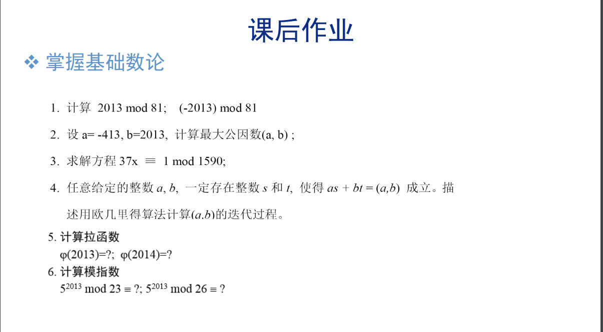

# chap08

[陈永俊] [522031910203]

## 8.1

$$
\begin{aligned}
    2013 \, mod \, 81 = 69\\
    -2013 \, mod \, 81 = 12\\
\end{aligned}
$$

## 8.2

$$
\begin{aligned}
    \gcd(2013,-413) & = \gcd(2013,413)\\
    & = \gcd(413, 2013\%413)\\
    & = \gcd(361, 413\%361)\\
    & = \gcd(52,361\%52)\\
    & = \gcd(49,52\%49)\\
    & = \gcd(3,49)\\
    & = \gcd(1,3\%1)\\
    & = \gcd(0,1)\\
    & = 1\\
\end{aligned}
$$

## 8.3

$$
\begin{aligned}
    \gcd(37,1590)=\gcd(36,37)1\\
    1 = 37-36*1\\
    36 = 1590-37*42\\
    1 = 37 - (1590-37*42)\\
    1 = 37*43 - 1590\\
    x = 43\\
\end{aligned}
$$

## 8.4

$$
\begin{aligned}
    as+bt=\gcd(a,b)\\
    (b\%a)s_1+at_1 = \gcd(b\%a,a)\\
    b = y*gcd,a=x*gcd\\
    (b\%a)s_1+at_1 = (y\%x)s_1*gcd+xt_1*gcd=k*gcd\\
    \implies \gcd(a,b)= \gcd(b\%a,a)\\
\end{aligned}
$$

## 8.5

$$
\begin{aligned}
    2013 = 3*11*61\\
    \psi(2013) =2*10*60 = 1200\\
    2014 = 2*1007\\
    \psi(2014) = 1*1006 = 1006\\
\end{aligned}
$$

## 8.6

$$
\begin{aligned}
    5^{22} = 1 (mod 23)\\
    5^{2013} = 5^{2013\%22} = 5^{11} = 22(mod 23)\\
    5^{2013} = 5^{2013\%26} = 5^{11} = 21(mod 26)\\
\end{aligned}
$$
