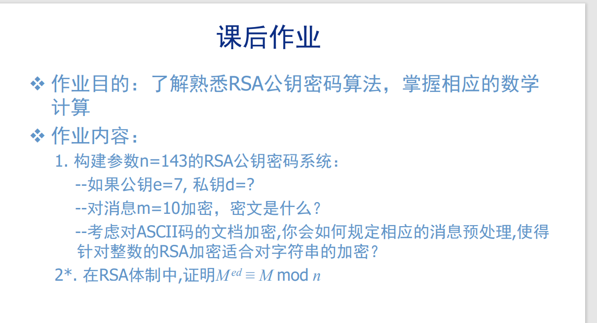

# chap09

[陈永俊] [522031910203]

## 9.1

$$
\begin{aligned}
    n = 13*11\\
    \varphi(n) = 12*10=120\\
    e = 7\implies d = 103\\
    M = m^{e} \, mod \, n=10\\
\end{aligned}
$$

在ASCII码文档中，可以将字符分组并，转成数字，再加密。

## 9.2

$$
\begin{aligned}
    M^{ed} \, mod \, p & = M^{k*(p-1)(q-1)+1} - M \, mod \,p\\
    & = M^{k*(p-1)(q-1)+1} \, mod \,p\\
    & = M  \, mod \,p\\
    q \text{ 同理 }\\
    由 CRT，M^{ed} & = M(mod \, n)\\
\end{aligned}
$$
