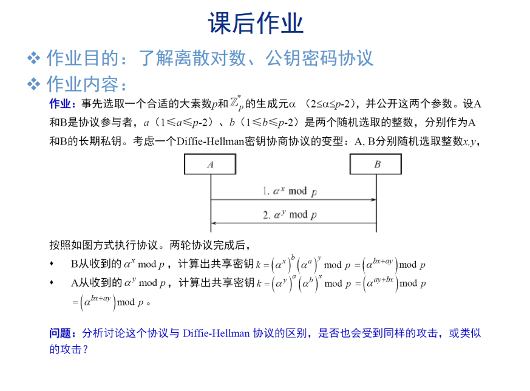

# chap10

[陈永俊] [522031910203]

## 2. **与标准 Diffie-Hellman 协议的区别**

- **标准 Diffie-Hellman**：
  - Alice 和 Bob 分别生成私钥 $a, b$，交换 $\alpha^a \mod p$ 和 $\alpha^b \mod p$，并计算共享密钥：
    $$
    k = (\alpha^b)^a = (\alpha^a)^b = \alpha^{ab} \mod p
    $$
- **该协议**：
  - 在标准 Diffie-Hellman 的基础上引入额外的随机数 $x, y$，交换 $\alpha^x \mod p$ 和 $\alpha^y \mod p$，并在密钥计算中混合了随机数。

## 3. **潜在的攻击分析**

1. **中间人攻击**：
   - 与标准 Diffie-Hellman 一样，该协议无法避免中间人攻击。如果攻击者 $E$ 拦截并分别与 Alice 和 Bob 建立独立的密钥交换，则 $E$ 可以伪装成合法参与者。
   - 解决方法：引入认证机制（例如使用数字签名或公钥基础设施，PKI）。

是否实现真正的安全性仍依赖于协议设计中对认证和密钥管理的考虑。
